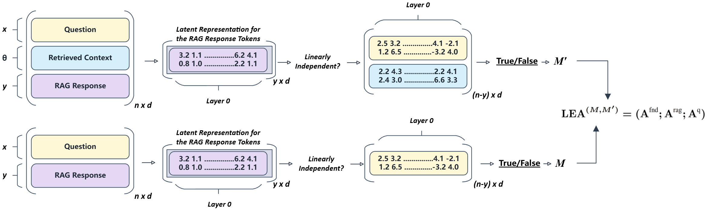

# LEA
LLM Embedding-based Attribution (LEA): Quantifying Source Contributions to Generative Model's Response for Vulnerability Analysis

## Overview
This work proposes LLM Embedding-based Attribution (LEA), an explainable metric to quantify the percentage of influence an LLM's pre-trained knowledge has versus retrieved context on its generated responses.

<p align="center">
  
</p>


LEA is applied on vulnerability analysis task under three different retrieval scenarios:

Valid retrieval: The LLM uses only the most relevant and verified information, and serves as a benchmark to evaluate the LEA distribution under optimal retrieval conditions.

Generic retrieval: The LLM does not have knowledge of the specific CVE and instead uses generalized information about a vulnerability.

Incorrect retrieval: The LLM uses incorrect or misleading retrieved information, such as details from a non-existent vulnerability. 


## Setup
Create a virtual environment and install the libraries:

```sh
python -m venv .venv
source .venv/bin/activate  # On macOS/Linux
.venv\Scripts\activate  # On Windows
pip install -r requirements.txt
```

---

## How to Run

First, to run the huggingface models, create a `.env` file and put your API Key:

```env
HUGGINGFACE_API_KEY=hf_XXXXXXXXXXXXXXXXXXXXXXXXXXXX
```


### 🏗️ Generation Pipeline

`generation.py` produces model outputs **with retrieval** (RAG) **and without retrieval** (base) in a single run, storing them as JSON. To modify the generation arguments, go to `configs/generation.yaml` file and pass the desired arguments (such as the model's name). To run:

```bash
$ python3 generation.py configs/generation.yaml 
```


### 🧮 LEA Analysis

After generation, compute LEA scores and probability values with `main.py`:

```bash
$ python3 main.py configs/analysis.yaml
```

Essential knobs in **`configs/analysis.yaml`**:

| Field                    | Purpose                                                          |
| ------------------------ | ----------------------------------------------------             |
| `data_row`               | Process a single row (int) or *all* rows (omit)                  |
| `threshold`              | Filter tokens with attribution < τ                               |
| `gt_distribution`        | `True` → evaluate RAG response; `False` → evaluate base response |
| `layer_by_layer_rank`    | Print per‑layer rank statistics                                  |
| `token_probs_diff_probs` | Plot Δ softmax probs between responses                           |

---

## 📊 Visualising Distributions

Generate LEA distributions by passing the path to the responses for all the LLMs (in the file):

```bash
$ python3 lea_distribution.py
```

Generate the scatter plots for the $A^{rag}$ distributions across different RAG scenarios by passing the path to the responses for all the LLMs (in the file):

```bash
$ python3 plot_rag_dist.py
```

Get the ROC curve with the $A^{rag}$ values to find the optimal threshold over the non-retrieval, generic retrieval, and ideal retrieval results:

```bash
$ python3 roc_analysis.py
```


---

## 📂 Repository Layout

```text
.
├── configs/           # YAML configs for generation & analysis
├── data/              # Curated CVE dataset (500 rows)
│   └── cve_data.csv
├── results/
│   └── Generation/
│   └── LEA/           
├── images/            # Diagrams & figures used in the paper
└── *.py               # Entry points & core library
```

---


## 🖥️ Hardware & Performance

All experiments in the paper were run on a workstation with:

* **256 GB RAM**
* 2 × **Intel Xeon E5‑2650** CPUs
* 2 × **NVIDIA Tesla P40**
* 1 × **NVIDIA Tesla V100**


## Acknowledgments

This material is based upon work supported by the National Science Foundation under Grant No. 2344237 and No. 2502341.
